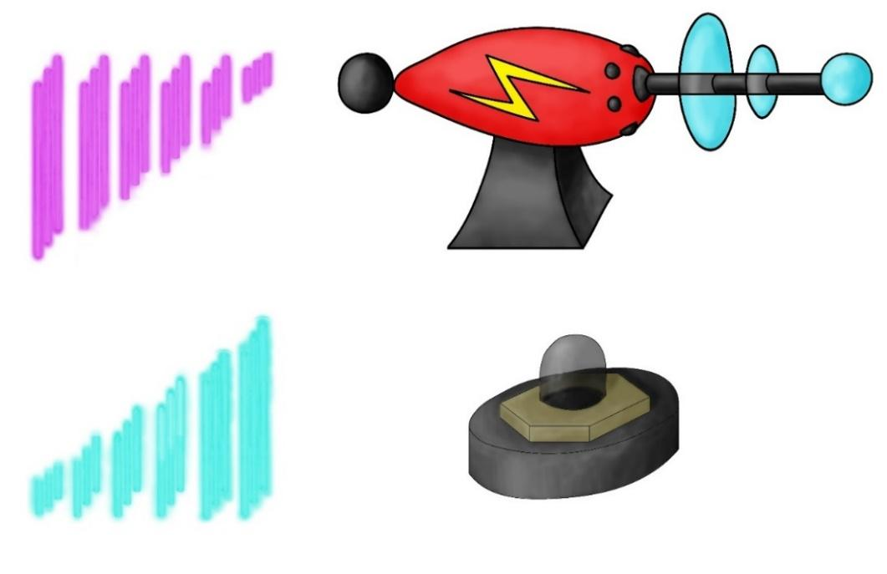
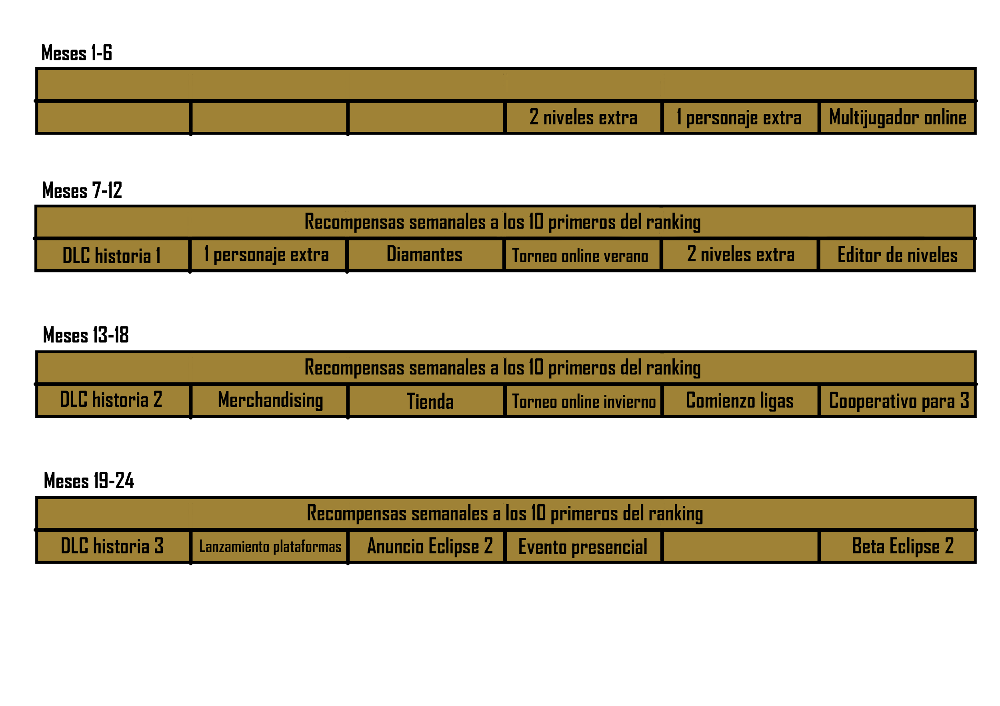

# CentauriProject

Índice de contenidos

>   [1. Identidad del Juego 2](#_Toc56709734)

>   [2. Eslogan 2](#_Toc56709735)

>   [3. Sinopsis 2](#_Toc56709736)

>   [4. Contexto del juego / Lore 2](#_Toc56709737)

>   [5. Mecánicas 3](#_Toc56709738)

>   [6. Modos de juego 4](#_Toc56709739)

>   [6.1. Modo historia 4](#_Toc56709740)

>   [6.2. Modo multijugador 4](#_Toc56709741)

>   [6.3. Modo infinito con ranking 4](#_Toc56709742)

>   [7. Diseño de niveles 5](#_Toc56709743)

>   [8. Estilo de Arte 12](#_Toc56709744)

>   [8.1. Personaje 13](#_Toc56709745)

>   [8.2. Backgrounds 13](#_Toc56709746)

>   [8.3. Assets 16](#_Toc56709747)

>   [9. Interfaz 22](#_Toc56709748)

>   [9.1. Versión PC 22](#_Toc56709749)

>   [9.2. Versión móvil 26](#_Toc56709750)

>   [10. Música y Sonido 28](#_Toc56709751)

>   [10.1. Música para la pantalla del menú 28](#_Toc56709752)

>   [10.2. Música dentro del juego 29](#_Toc56709753)

>   [10.2.1. Tema 1 29](#_Toc56709754)

>   [10.2.2. Tema 2 29](#_Toc56709755)

>   [10.2.3. Tema 3 30](#_Toc56709756)

>   [10.3. Efectos de sonido 30](#_Toc56709757)

>   [11. Modelo de negocio y monetización 31](#_Toc56709758)

>   [11.1. Modelo de negocio 31](#_Toc56709759)

>   [11.2. Monetización 31](#_Toc56709760)

>   [11.3. Crowdfunding 32](#_Toc56709761)

>   [11.4. Planificación 24 meses 33](#_Toc56709762)

>   [12. Hoja de ruta del desarrollo / Lanzamiento 33](#_Toc56709763)

## Identidad del Juego

Juego de estilo plataformas con puzles que puede jugarse tanto en modo historia
como en modo cooperativo de dos jugadores.

El objetivo principal consiste en cooperar entre los dos personajes para
conseguir los amuletos que se encuentran al final de cada uno de los distintos
niveles, de forma que los personajes vayan adquiriendo su poder y puedan acabar
con la maldición que está destruyendo el mundo.

## Eslogan

Descubre la aventura de dos gemelos malditos, separados al nacer pero
predestinados a encontrarse. Lucharán juntos para evitar la profecía y restaurar
la paz en el mundo.

Enrevesado, dinámico, coordinación extrema.

## Sinopsis

Según cuenta la leyenda, el primer embarazo del milenio estará maldito. La madre
daría a luz a dos gemelos que materializarían los conceptos de luz y oscuridad
en el mundo, y que serían complementarios, inseparables. En el año 3000 d.C.
nacen dos gemelos que parecen cumplir dicha profecía: Hyperion, el portador de
la luz, y Érebos, el portador de la oscuridad. Su madre no es capaz de cumplir
el deseo de la profecía y asesinar a uno de ellos, así que los envía a lugares
lejanos con la esperanza de que la maldición se deshaga.

Sin embargo, dicha maldición permanece intacta y la desolación empieza a arrasar
el mundo. Pero una parte de la leyenda había permanecido oculta: los gemelos
acabarían encontrándose y gracias a sus fuerzas y al poder de los amuletos de
*Seramar* esparcidos por el mundo, podrían acabar con el hechizo perverso que
estaba asolando el planeta.

## Contexto del juego / Lore

Cuenta la leyenda que, el primer embarazo de cada milenio, estaría maldito. La
desdichada madre engendraría a dos gemelos cuya alma estuviera dividida, rota.
En uno de ellos se sembraría de la semilla de la luz, en el otro, la de la
oscuridad. Igual que no existe la noche sin el día, no podrían vivir el uno sin
el otro.

Las leyendas siempre parecen inalcanzables, místicas… Hasta que se convierten en
realidad.

En el año 3000 d.C., en una pequeña villa llamada Surgray, nacieron dos hermosos
niños. A uno lo llamaron Hyperion, en honor al dios griego del Sol, pues parecía
que irradiaba luz. Al otro, lo llamaron Érebos, pues sus rasgos recordaban al
dios griego de la oscuridad. Sus padres, nada más verlos nacer, no pudieron
evitar pensar en la famosa leyenda del primer embarazo del milenio.

Esa misma noche, la madre soñó que el mundo se apagaba, hasta que mató a uno de
sus hijos, y todo se iluminó. Se despertó asustada, pero enseguida se quedó
dormida, pues había sido un día agotador. Al volver a dormirse, tuvo otra vez la
misma pesadilla, pero esta vez mataba a su otro hijo. En ese momento, aceptó
resignada lo que sus ojos se negaban a admitir: que la profecía era cierta, y
que debía matar a uno de sus hijos para salvar el mundo. Después de varios días
sin dormir, decidió que no era capaz de hacerlo. Matar a uno de sus hijos era
matar a una parte de sí misma.

Sin embargo, se le ocurrió una idea. Pensó que, si sus hijos nunca se conocían,
la profecía se rompería. Al día siguiente, dejó a uno de ellos en un pueblo
lejano, y al otro lo arrastró en una barca río abajo. Había abandonado a sus
hijos, pero al menos sus corazones seguían latiendo.

Desafortunadamente, la madre no podía haber estado más equivocada. El
apocalipsis había comenzado. Pero había una parte de la leyenda que se había
perdido a través de la historia. Independientemente de la distancia a la que se
encontraran, los gemelos lograrían encontrarse, atraídos por el magnetismo
natural de sus almas. Si juntaban las fuerzas de la luz y la oscuridad,
alcanzarían un poder increíble, pero no sería suficiente para combatir la
adversidad. Sin embargo, si conseguían juntar la magia de los amuletos de
Seramar repartidos por todo el mundo, podrían devolver la paz al mismo.

## Mecánicas

Aprovechando los puntos diferenciales de la historia, Eclipse se centra en las
ideas de luces y sombras. De esta forma, un jugador representa la claridad y
otro la oscuridad, encarnando a Hyperion, dios griego de la luz, y a Érebos,
dios griego de las sombras. Esto se logra tanto en modo multijugador como en
modo historia, pudiendo en este caso cambiar de jugador mediante una tecla.

Se utilizan mecánicas relacionadas con el concepto de luminosidad, como por
ejemplo los láseres y los espejos (luz) y los portales (oscuridad). Además, se
explota mucho la idea de compenetración entre los personajes (gemelos), pues en
todas las mecánicas se necesita la ayuda del otro personaje para progresar. Todo
ello está en consonancia con la historia del juego, ya que ambos personajes
deben unir fuerzas para acabar con la maldición y salvar el mundo.

A continuación se muestran las mecánicas principales, distribuidas en distintos
niveles:

-   Mecánica de los portales, tanto para traspasar objetos como para que un
    personaje se pase a la parte del nivel del otro.

-   Mecánica de arrastrar objetos y moverlos para poder acceder a determinadas
    plataformas o para poder saltar en esos objetos y no caer a los pinchos.

-   Mecánica de mover espejos hasta dar con la posición adecuada, para hacer
    rebotar láseres.

-   Mecánica de invertir la gravedad del otro personaje.

-   Mecánica de que las plataformas se van cayendo al tocarlas o al pasar cierto
    tiempo.

-   Mecánica de que un personaje se pasa a la parte del otro para poder
    ayudarle.

-   Mecánica de las placas de presión que activan puertas o plataformas.

-   Mecánica de las plataformas que se mueven al ponerse encima, mediante los
    controles de salto.

## Modos de juego

El juego cuenta con diez tipos distintos de niveles, de los cuales cinco son de
dificultad baja y tienen una duración aproximada de dos minutos cada nivel,
mientras que los otros cinco son de dificultad alta y duran unos cinco minutos
cada uno. Además, existe un modo infinito en el que se van combinando estos
módulos.

## 6.1. Modo historia

En el modo historia, el jugador descubrirá la historia de Érebos e Hyperion, y
les acompañará en su búsqueda de los amuletos de Seramar a lo largo de 10
niveles que plantearán diversas mecánicas de resolución de problemas, puzzles y
habilidad.

## 6.2. Modo multijugador

El modo multijugador permite que 2 jugadores compartan la historia de Eclipse en
un mismo dispositivo. De esta manera, podrán jugar tanto el modo historia de
manera cooperativa, como hacer frente juntos al desafío añadido que supone el
modo infinito.

## 6.3. Modo infinito con ranking

El modo infinito supone el desafío final para los jugadores de Eclipse. Los
jugadores veteranos, que hayan superado el modo historia, verán en él un nivel
de dificultad extra. En él, ya sea de manera individual o cooperativamente, los
jugadores tendrán que superar el máximo número de salas posibles, antes de que
pierdan su vida, o termine el tiempo.

Además, la dificultad aumenta progresivamente, dificultando aún más el desafío,
pues el tiempo disponible disminuirá en función del número de salas superadas.

## Diseño de niveles

A continuación se muestra el diseño de cada uno dichos niveles.

*Diseño de niveles 1 y 2*

*Diseño de niveles 3 y 4*

*Diseño de niveles 5 y 6*

*Diseño de niveles 7 y 8*

*Diseño de niveles 9 y 10*

A continuación se muestra cómo se ven finalmente los niveles.

## Estilo de Arte

Se trata de un juego con estética cartoon, simple pero vistoso. El estilo es
sencillo, sin gran cantidad de detalles para no sobrecargar el escenario,
centrándose en la jugabilidad del nivel y en la estrategia del mismo.

En lo referente a las cámaras, Eclipse cuenta con dos de ellas. Se utiliza una
cámara en la sección inferior y otra para la superior, de manera que cada
sección pueda tener una gravedad distinta (invertida).

Tal y como se ha introducido en la historia, la ambientación del videojuego se
centra en un mundo futurista y la vez fantástico, en el que se entremezclan
elementos como las profecías o los amuletos con láseres y portales
teletransportadores.

Como referencia, se han tomado juegos de plataformas con estética cartoon como
Assassin’s Creed Chronicles o The Cave, coincidiendo además con este último en
ser un juego de puzles y coordinación entre varios personajes.

*Assassin's Creed Chronicles y The Cave*

Para los recursos visuales, se han empleado los siguientes programas, ambos
adquiridos con licencia universitaria a través de *Privio*.

-   Adobe Photoshop

-   [Adobe Illustrator](https://www.adobe.com/es/products/illustrator.html)

## 8.1. Personaje

La estética del personaje se basa en la capucha utilizada en Zelda o en el
mencionado Assassin’s Creed. También se ha añadido como señal distintiva un
pañuelo que cubre la parte inferior de la cara del personaje, así como un traje
de estilo medieval.

Además, como un personaje simboliza la luz y otro la oscuridad, se ha empleado
para Hyperion una paleta de colores cálidos y para Érebos una paleta de colores
más fríos.

*Diseño del personaje*

A continuación se muestra el personaje junto con su ciclo de pasos.

*Ciclo de pasos del personaje*

## 8.2. Backgrounds

A continuación se muestran los backgrounds utilizados.

*Background de la fábrica*

*Background de la jungla*

*Background del espacio*

*Background del oeste*

## 8.3. Assets

A continuación se muestran los assets del juego empleados.

*Espejos para reflejar el láser*

*Palanca para activar gravedad*

*Assets para las paredes*

*Pistola láser y receptor*

*Andamio, plataforma y caja*

*Portales*

*Botones*

*Amuletos necesarios para acabar el nivel*

*Pinchos superiores e inferiores*

*Tipos de suelos*

*Placas de presión*

*Puerta y plataformas*

## Interfaz

Como se observa en el apartado 6.1, las interfaces están en consonancia con el
título del juego (Eclipse) y con su historia, casando con los conceptos de
eclipse y luminosidad. Dichas interfaces están divididas en dos secciones
(superior e inferior), simulando una la luz y otra la oscuridad, además de
anticipar la dinámica del juego cooperativo con la pantalla dividida.

En lo referente a los controles, en su versión en ordenador se utilizan las
teclas *A* y *D* para el movimiento a la izquierda y a la derecha, la tecla *W*
para el salto, el *Space* para cambiar de jugador en modo individual y la tecla
*Escape* para abrir el menú de pausa. En la versión para móvil se emplean teclas
que se superponen en la pantalla.

En el modo cooperativo, se sustituye la mecánica de cambio de jugador (*Space*),
por un segundo trío de botones, utilizará el segundo jugador. En este caso, se
incluyen las teclas *J* y *L* para desplazarse hacia izquierda y derecha, y la
tecla *I* para el salto.

## 9.1. Versión PC

*Interfaz de la pantalla de controles*

*Interfaz del menú principal*

*Interfaz de la pantalla de selección de nivel*

*Interfaz de la pantalla de contacto*

*Interfaces del menú de pausa y game over*

Además, el juego cuenta con una versión en inglés.

*Interfaz de la pantalla de selección de idioma*

## 9.2. Versión móvil

A continuación se muestra la versión para dispositivos móviles, que cuentan con
unos botones superpuestos para los controles.

*Interfaces de la versión móvil*

*Controles del modo un jugador en móvil*

*Controles del modo cooperativo en móvil*

## Música y Sonido

El videojuego cuenta con los siguientes tipos de canciones: música en el menú,
música de créditos y música dentro del juego (que consta de dos versiones).
Además, se incluyen varios efectos de sonido.

## 10.1. Música para la pantalla del menú

Con este tema, se pretendía componer un tema que transmitiese intriga y
misterio, así como que creara una sensación fría, tenebrosa y sombría.

Para conseguir transmitir todo esto al jugador, se ha dado el protagonismo a
instrumentos graves como el bajo electrónico. Por otro lado, también se ha usado
melodías suaves, lentas y tranquilas, para seguir consiguiendo esta percepción,
así como efectos de sonido que provocan la sensación que vienen de lejos y se
acercan a nosotros, generando algo de intranquilidad o de que algo acecha y
rodea al jugador.

A nivel compositivo, esta canción es un *loop*. Para que no sea repetitiva para
el usuario se ha optado por meter pequeños elementos diferenciales y que sea un
tema con distintas partes con matices bien diferenciados como el uso de
percusión o los ya mencionados efectos de sonido, evitando de esta forma
producir una sensación de cansancio en el usuario.

## 10.2. Música dentro del juego

## 10.2.1. Tema 1

Para el desarrollo de las partidas, se ha compuesto una melodía con la que se ha
tratado de dar una sensación más espacial, pensando en aquellos niveles con
estética y dinámica más futurista. Se ha tratado de transmitir al usuario una
sensación de misterio, de manera que sigue la línea marcada por el menú y el
tema compuesto para dichas pantallas.

Por ello, se ha compuesto este tema de una manera incremental y progresiva.
También se ha optado por el uso de tonalidades más graves al comienzo hasta que
llega a la melodía principal de violín que recoge todo el protagonismo, siendo
asimismo más calmada. Tras este progreso hacia la melodía principal y su
desarrollo, se continúa hasta terminar como se comenzó, con el sintetizador que
desaparece de manera progresiva, intentando despertar de nuevo en el usuario una
sensación tenebrosa y de misterio. Para ello, el tema desaparece lentamente y se
percibe que se va "alejando".

## 10.2.2. Tema 2

Para este tema, se decidió romper un poco con la línea de los otros dos temas
para que de esta manera el jugador tuviese una música con una melodía más alegre
y activa, que dejase una buena sensación en él.

Este tema está más destinado a niveles de habilidad, donde no haya tanta
sensación de secretismo ni de ocultación. Niveles más ágiles y rápidos y sin
tanta pausa de por medio.

No obstante, tampoco se quería perder la esencia fundamental y tiene arreglos
que provocan en el jugador sensaciones transmitidas con los otros dos temas,
sobre todo al final, donde concluye con un *fadeout*.

## 10.2.3. Tema 3

Este tema comienza con mucha energía y a medida que avanza, mezcla esta
sensación tan enérgica con partes más tranquilas en su melodía. Tras ello, a
mitad del tema se llega a una parte que produce una sensación de nostalgia
gracias al arreglo del sintetizador con tonalidad más grave, para de nuevo subir
dicha tonalidad y comenzar con una parte con mucho más ritmo. Finalmente, el
tema termina de una manera más relajada volviendo a las emociones de la parte
media del tema.

## 10.3. Efectos de sonido

En el videojuego se incluyen los siguientes tipos de efectos de sonido:

-   Efecto para los botones.

-   Efecto al conseguir diamante.

-   Efecto de electricidad.

-   Efecto para los espejos.

-   Efecto para el láser.

-   Efecto la palanca.

-   Efecto para abrir las puertas.

-   Efecto para las barreras.

-   Efectos para el nivel musical.

Los programas y recursos utilizados para la creación y edición de la música y de
los efectos de sonido son los siguientes:

-   [Audacity](https://www.audacityteam.org/)

-   [Music Maker](https://www.magix.com/es/musica/music-maker/)

-   [Free Audio Library](https://sfx.freeaudiolibrary.com/es/)

-   [Generador de Frecuencias](https://www.szynalski.com/tone-generator/)

Todos ellos permiten utilizar su contenido siempre y cuando no se utilicen en un
producto con ánimo de lucro.

## Modelo de negocio y monetización

## 11.1. Modelo de negocio

## 11.2. Monetización

Opciones que me parecen las mejores en nuestro caso:

-   Donación itch.io: el usuario aportaría la cantidad que desee para contribuir
    al desarrollo del contenido extra del videojuego, y una futura segunda
    parte.

-   Beta abierta

-   F2P con microtransacciones: a partir del lanzamiento de la tienda se
    permitirá comprar diamante a cambio de una pequeña cantidad de dinero, que
    podrán ser utilizados para gastar en la tienda, bien en personajes nuevos,
    niveles, o assets para el editor de niveles.

-   DLCs gratuitos

-   Pre-order para la segunda edición del videojuego con contenido exclusivo
    para aquellos usuarios que lo hayan reservado.

Para la promoción de Eclipse se está empleando la red social Twitter así como la
página que pronto estará habilitada en Indiegogo (donde se hace la campaña de
crowdfunding).

## 11.3. Crowdfunding

Para el lanzamiento del videojuego, se ha optado por una campaña de crowdfunding
mediante la plataforma Indiegogo, con el objetivo de recaudar fondos para seguir
mejorando dicho juego en un futuro, mediante nuevos niveles, nuevos modos de
juego, ampliación del lore...

En la plataforma indiegogo se ha creado una campaña donde aquellas personas que
aporten un donativo de 2 euros se les recompensará con contenido exclusivo que
se puede obtener únicamente a través de esta plataforma, ya que el juego en sí
es gratis, disponible en itch.io.

La campaña dura 60 días, y en caso de no llegar a la meta, el dinero obtenido se
invertirá en el desarrollo de siguientes ediciones, además para la organización
de torneos y eventos presenciales.

<https://www.indiegogo.com/project/preview/254c16a3#/>

## 11.4. Planificación 24 meses

## Hoja de ruta del desarrollo / Lanzamiento

**Plataformas:** Web (PC y dispositivos móviles).

**Audiencia:**

Plataformas 2D con modo historia y multijugador apto para todos los públicos
(PEGI 3).

Público objetivo: jugadores adolescentes o adultos amantes de los juegos de
plataformas, estrategia y puzles, especialmente debido a su lore y dificultad.

**Hoja de ruta del desarrollo:**

**Hito 1:** Crear cuentas de redes sociales – 07/10/2020.

**Hito 2:** Elegir temática e ideas generales del juego – 12/10/2020.

**Hito 3:** Plantear niveles de forma teórica – 20/10/2020.

**Hito 4:** Diseño de niveles 1, 2, 3, 4, 5 y 6 – 06/11/2020.

**Hito 5:** Diseñar protagonista – 08/11/2020.

**Hito 6:** Programación básica de movimiento de personaje y cámaras –
09/11/2020.

**Hito 7:** Programación de plataformas – 09/11/2020.

**Hito 8:** Escena 1 – 10/11/2020.

**Hito 9:** Diseño de niveles 7, 8, 9 y 10 – 11/11/2020.

**Hito 10:** Ciclo de pasos y animaciones de los personajes– 11/11/2020.

**Hito 11:** Implementar todas las mecánicas con *placeholders* – 12/11/2020.

**Hito 12:** Escenas 2, 3 y 4 – 12/11/2020.

**Hito 13:** Escena 5 y 6 – 13/11/2020.

**Hito 14:** Meter tilemaps – 13/11/2020.

**Hito 15:** Terminar guión/historia– 13/11/2020.

**Hito 16:** Escenas 7, 8, 9 y 10 – 14/11/2020.

**Hito 17:** Añadir música – 15/11/2020.

**Hito 18:** Diseñar plataformas – 15/11/2020.

**Hito 19:** Diseñar backgrounds – 15/11/2020.

**Hito 20:** Añadir botones para móvil – 17/11/2020

**Hito 21:** Parte estética de la interfaz – 17/11/2020

**Hito 22:** Terminar temas musicales – 18/11/2020

**Hito 23:** Modo infinito con ranking – 18/11/2020

**Hito 23:** Multijugador local – 19/11/2020

**Hito 23:** Terminar portfolio – 19/11/2020
